# Design Document: SchemeFinder - Government Scheme Discovery Platform

## Overview

SchemeFinder is a full-stack web application that helps Indian citizens discover and check eligibility for 3000+ government schemes. The system consists of three main components:

1. **Frontend Application**: React-based SPA with TypeScript, providing search, filtering, eligibility checking, and user dashboard functionality
2. **Backend Services**: Supabase-powered backend with PostgreSQL database, authentication, and Row-Level Security
3. **Data Processing Pipeline**: Python-based ETL pipeline for ingesting, cleaning, and standardizing government scheme data

The architecture follows a read-heavy pattern optimized for fast browsing and filtering, with a separate offline data processing pipeline for scheme ingestion.

## Architecture

### Detailed System Architecture (Box Diagram)

```
┌────────────────────────────────────────────────────────────┐
│                      CLIENT LAYER                          │
│         Web Browser (Desktop / Mobile)                     │
└──────────────────────────┬─────────────────────────────────┘
                           │
                           ▼
┌────────────────────────────────────────────────────────────┐
│                 FRONTEND APPLICATION                       │
│      React + TypeScript (Vite + Tailwind CSS)              │
│                                                            │
│  ┌─────────────────────┐  ┌───────────────────────────┐  │
│  │  Routing Layer      │  │ Global State Management   │  │
│  │  (React Router)     │  │ (Context API)             │  │
│  └─────────────────────┘  └───────────────────────────┘  │
│                                                            │
│  ┌─────────────────────┐  ┌───────────────────────────┐  │
│  │  Search Engine      │  │ Multi-Dimensional Filter  │  │
│  │  • Debounce 300ms   │  │ • AND-based Rule Logic    │  │
│  │  • Keyword Match    │  │ • Range & Category Match  │  │
│  └─────────────────────┘  └───────────────────────────┘  │
│                                                            │
│  ┌───────────────────────────────────────────────────┐   │
│  │      Eligibility Engine (Client-Side)            │   │
│  │      • 6-Step User Input                         │   │
│  │      • Constraint Evaluation                     │   │
│  │      • Weighted Scoring                          │   │
│  │      • Ranked Output                             │   │
│  └───────────────────────────────────────────────────┘   │
│                                                            │
│  ┌─────────────────────┐  ┌───────────────────────────┐  │
│  │  Scheme Rendering   │  │ Save Scheme Logic         │  │
│  │  • Pagination       │  │ • Auth Check              │  │
│  │  • Detail View      │  │ • Persist to Backend      │  │
│  └─────────────────────┘  └───────────────────────────┘  │
└──────────────────────────┬─────────────────────────────────┘
                           │
                           │ REST API / HTTPS
                           ▼
┌────────────────────────────────────────────────────────────┐
│                     BACKEND LAYER                          │
│                 Supabase (Auth + RLS)                      │
│                                                            │
│  ┌─────────────────────┐  ┌───────────────────────────┐  │
│  │  Authentication     │  │ User Saved Schemes Table  │  │
│  │  • Email/Password   │  │ • User-Scheme Mapping     │  │
│  │  • Session Tokens   │  │ • Row-Level Security      │  │
│  └─────────────────────┘  └───────────────────────────┘  │
└──────────────────────────┬─────────────────────────────────┘
                           │
                           ▼
┌────────────────────────────────────────────────────────────┐
│                   DATABASE LAYER                           │
│            PostgreSQL (Schemes + User Data)                │
│                                                            │
│  ┌───────────────────────────────────────────────────┐   │
│  │  Schemes Table (3000+ records)                    │   │
│  │  • Full scheme details with eligibility           │   │
│  │  • Indexed for fast search and filtering          │   │
│  └───────────────────────────────────────────────────┘   │
│                                                            │
│  ┌───────────────────────────────────────────────────┐   │
│  │  Users Table (Managed by Supabase Auth)           │   │
│  │  • User credentials and profile                   │   │
│  └───────────────────────────────────────────────────┘   │
│                                                            │
│  ┌───────────────────────────────────────────────────┐   │
│  │  Saved_Schemes Table (User bookmarks)             │   │
│  │  • User-Scheme associations with RLS              │   │
│  └───────────────────────────────────────────────────┘   │
└────────────────────────────────────────────────────────────┘

            OFFLINE DATA PROCESSING PIPELINE
┌────────────────────────────────────────────────────────────┐
│               PYTHON ETL DATA PIPELINE                     │
│                                                            │
│  Public Govt Sources (HTML/PDF)                            │
│              ↓                                             │
│  Data Ingestion (Web Scraping / PDF Parsing)               │
│              ↓                                             │
│  Cleaning & Deduplication                                  │
│              ↓                                             │
│  Eligibility Extraction (NLP / Pattern Matching)           │
│              ↓                                             │
│  Standardization (Age, Income, State, Category)            │
│              ↓                                             │
│  Validation (Required Fields Check)                        │
│              ↓                                             │
│  Load to PostgreSQL (Structured Scheme Dataset)            │
│              ↓                                             │
│  Processing Report (Stats & Errors)                        │
└──────────────────────────┬─────────────────────────────────┘
                           │
                           ▼
┌────────────────────────────────────────────────────────────┐
│           STRUCTURED SCHEME DATASET                        │
│           Stored in PostgreSQL Database                    │
│           Accessed by Frontend via Supabase API            │
└────────────────────────────────────────────────────────────┘
```

### Complete User Journey Flow (Box Style)

```
┌─────────────────────────────────────────────────────────────────────┐
│                         USER ENTRY POINT                            │
│                    User Visits SchemeFinder                         │
└────────────────────────────┬────────────────────────────────────────┘
                             │
                ┌────────────┴────────────┐
                │                         │
                ▼                         ▼
┌───────────────────────────┐   ┌───────────────────────────┐
│   BROWSE & SEARCH PATH    │   │  ELIGIBILITY CHECK PATH   │
│                           │   │                           │
│  1. View Scheme List      │   │  1. Start Eligibility     │
│     (3000+ schemes)       │   │     Form                  │
│                           │   │                           │
│  2. Enter Search Query    │   │  2. Complete 6 Steps:     │
│     • Debounce 300ms      │   │     • Personal Details    │
│     • Keyword Match       │   │     • Location            │
│                           │   │     • Demographics        │
│  3. Apply Filters         │   │     • Income              │
│     • State               │   │     • Employment          │
│     • Ministry            │   │     • Special Categories  │
│     • Gender              │   │                           │
│     • Age Range           │   │  3. Submit Form           │
│     • Income Range        │   │                           │
│     • Caste Category      │   │  4. Eligibility Engine    │
│     • Employment          │   │     Evaluates:            │
│     • Disability          │   │     • All Constraints     │
│                           │   │     • Calculates Scores   │
│  4. View Filtered Results │   │     • Ranks Schemes       │
│     (20 per page)         │   │                           │
│                           │   │  5. View Eligible Schemes │
│  5. Select Scheme         │   │     (Sorted by Score)     │
└────────────┬──────────────┘   └────────────┬──────────────┘
             │                               │
             └───────────┬───────────────────┘
                         │
                         ▼
┌─────────────────────────────────────────────────────────────────────┐
│                      SCHEME DETAIL VIEW                             │
│                                                                     │
│  Display Complete Information:                                      │
│  • Scheme Name & Description                                        │
│  • Ministry & Category                                              │
│  • State Applicability                                              │
│  • Eligibility Criteria (Formatted List)                            │
│  • Benefits (Formatted List)                                        │
│  • Required Documents (Formatted List)                              │
│  • Official Link (If Available)                                     │
│  • Save/Bookmark Button                                             │
└────────────────────────────┬────────────────────────────────────────┘
                             │
                             ▼
                    ┌────────────────┐
                    │ User Clicks    │
                    │ Save/Bookmark  │
                    └────────┬───────┘
                             │
                             ▼
┌─────────────────────────────────────────────────────────────────────┐
│                    AUTHENTICATION CHECK                             │
│                                                                     │
│                    ┌─────────────────┐                              │
│                    │ Authenticated?  │                              │
│                    └────┬────────┬───┘                              │
│                         │        │                                  │
│                    YES  │        │  NO                              │
│                         │        │                                  │
│                         ▼        ▼                                  │
│         ┌──────────────────┐  ┌──────────────────┐                 │
│         │  Proceed to Save │  │  Show Auth Modal │                 │
│         └────────┬─────────┘  └────────┬─────────┘                 │
│                  │                      │                           │
│                  │                      ▼                           │
│                  │            ┌──────────────────┐                  │
│                  │            │ Login / Register │                  │
│                  │            │                  │                  │
│                  │            │ • Email          │                  │
│                  │            │ • Password       │                  │
│                  │            │ • Validation     │                  │
│                  │            └────────┬─────────┘                  │
│                  │                     │                            │
│                  │                     ▼                            │
│                  │            ┌──────────────────┐                  │
│                  │            │ Create Session   │                  │
│                  │            │ • Access Token   │                  │
│                  │            │ • Refresh Token  │                  │
│                  │            └────────┬─────────┘                  │
│                  │                     │                            │
│                  └─────────────────────┘                            │
│                                        │                            │
└────────────────────────────────────────┼────────────────────────────┘
                                         │
                                         ▼
┌─────────────────────────────────────────────────────────────────────┐
│                      SAVE SCHEME OPERATION                          │
│                                                                     │
│  1. Verify Session Token                                            │
│  2. Check Row-Level Security                                        │
│  3. Create User-Scheme Association                                  │
│  4. Store in saved_schemes Table                                    │
│  5. Return Success Confirmation                                     │
└────────────────────────────┬────────────────────────────────────────┘
                             │
                             ▼
┌─────────────────────────────────────────────────────────────────────┐
│                    USER DASHBOARD                                   │
│                                                                     │
│  Display Saved Schemes:                                             │
│  • List of All Bookmarked Schemes                                   │
│  • Quick Access to Scheme Details                                   │
│  • Remove Bookmark Option                                           │
│  • Consistent Rendering with Browse View                            │
│                                                                     │
│  Actions Available:                                                 │
│  • View Scheme Details                                              │
│  • Remove from Saved List                                           │
│  • Return to Browse/Search                                          │
└─────────────────────────────────────────────────────────────────────┘
```

### System Architecture Diagram

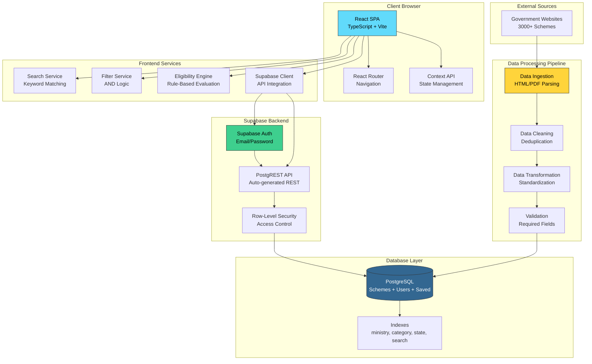

### High-Level Architecture

The system follows a three-tier architecture with clear separation of concerns:

**Tier 1 - Presentation Layer (Frontend):**
- React 18 SPA with TypeScript for type safety
- Vite for fast development and optimized builds
- Tailwind CSS for responsive, utility-first styling
- React Router for client-side routing
- Context API for lightweight global state management

**Tier 2 - Application Layer (Services):**
- Search Service: In-memory full-text search with debouncing
- Filter Service: Multi-dimensional filtering with AND logic
- Eligibility Engine: Rule-based constraint matching and scoring
- Supabase Client: API integration for auth and data operations

**Tier 3 - Data Layer (Backend):**
- Supabase: Backend-as-a-Service platform
- PostgreSQL: Relational database with JSONB support
- PostgREST: Auto-generated REST API from database schema
- Row-Level Security: Database-level access control
- Indexes: Optimized queries for ministry, category, state, and full-text search

**Offline Processing:**
- Python ETL Pipeline: Separate from main application
- Runs periodically to ingest new schemes
- Processes unstructured government data
- Loads cleaned data into PostgreSQL

### Deployment Architecture

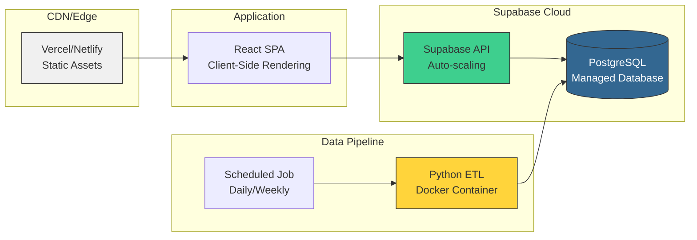

### Component Architecture

The frontend follows a layered architecture:

- **Presentation Layer**: React components with Tailwind CSS styling
- **State Management Layer**: Context API for global state (auth, saved schemes)
- **Service Layer**: API clients for Supabase interactions
- **Routing Layer**: React Router for navigation

The backend leverages Supabase's built-in features:

- **Authentication**: Supabase Auth with email/password
- **Database**: PostgreSQL with PostgREST API
- **Security**: Row-Level Security policies
- **Real-time**: Optional real-time subscriptions for saved schemes

### Data Flow

**User Journey Flow Diagram:**

```mermaid
flowchart LR
    subgraph Entry["Entry Points"]
        A[User Visits Site]
    end
    
    subgraph Browse["Browse & Search"]
        B[View Scheme List]
        C[Enter Search Query]
        D[Apply Filters]
        E[View Results]
    end
    
    subgraph Detail["Scheme Details"]
        F[Select Scheme]
        G[View Full Details]
    end
    
    subgraph Eligibility["Eligibility Check"]
        H[Start Eligibility Form]
        I[Complete 6 Steps]
        J[Submit Form]
        K[View Eligible Schemes]
    end
    
    subgraph Auth["Authentication"]
        L{Authenticated?}
        M[Login/Register]
        N[Create Session]
    end
    
    subgraph Save["Save & Manage"]
        O[Save Scheme]
        P[View Dashboard]
        Q[Manage Saved Schemes]
    end
    
    A --> B
    B --> C
    B --> D
    C --> E
    D --> E
    E --> F
    F --> G
    
    A --> H
    H --> I
    I --> J
    J --> K
    K --> F
    
    G --> L
    L -->|No| M
    M --> N
    N --> O
    L -->|Yes| O
    O --> P
    P --> Q
    
    style Entry fill:#e1f5ff,stroke:#333
    style Browse fill:#fff4e1,stroke:#333
    style Detail fill:#e8f5e9,stroke:#333
    style Eligibility fill:#f3e5f5,stroke:#333
    style Auth fill:#ffe0b2,stroke:#333
    style Save fill:#c8e6c9,stroke:#333
```

**System Data Flow Diagram:**

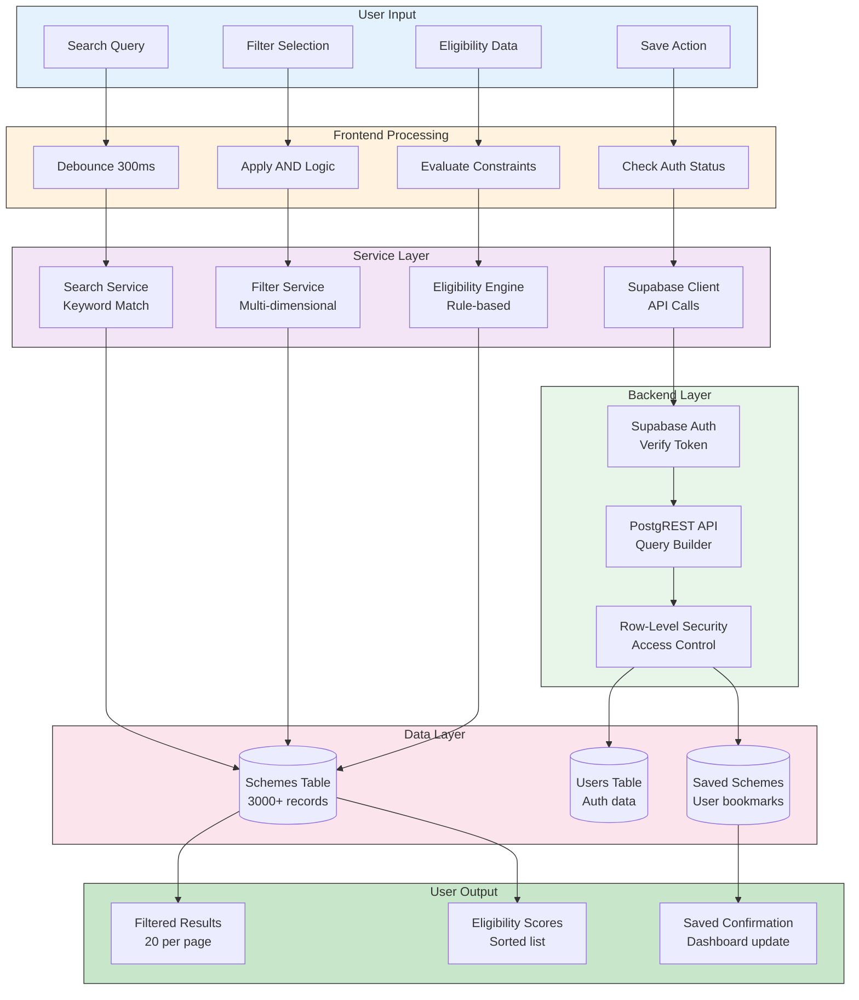

**Browse/Search Flow:**
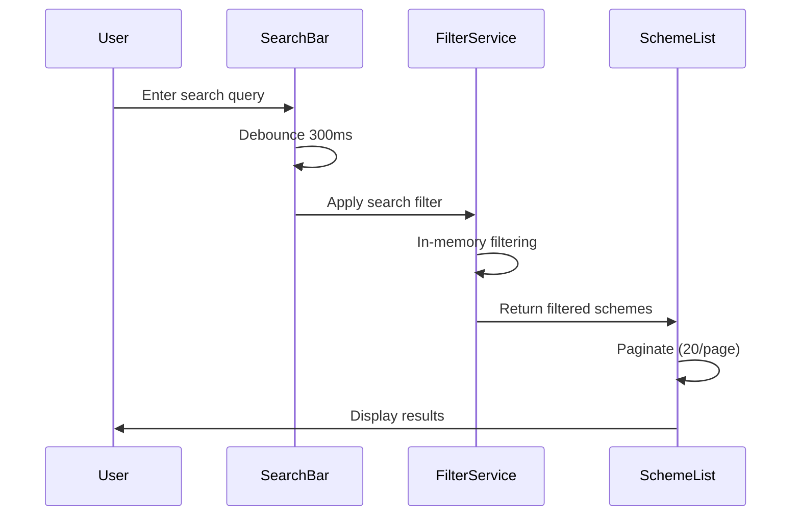

**Eligibility Check Flow:**
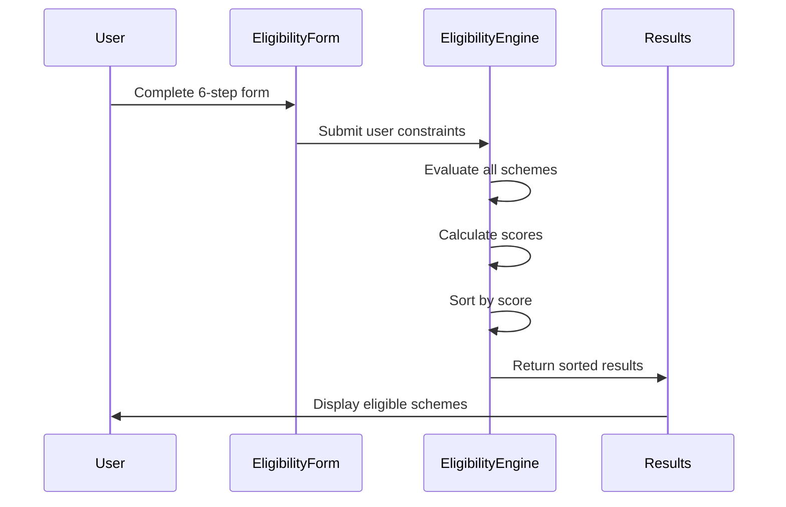

**Save Scheme Flow:**
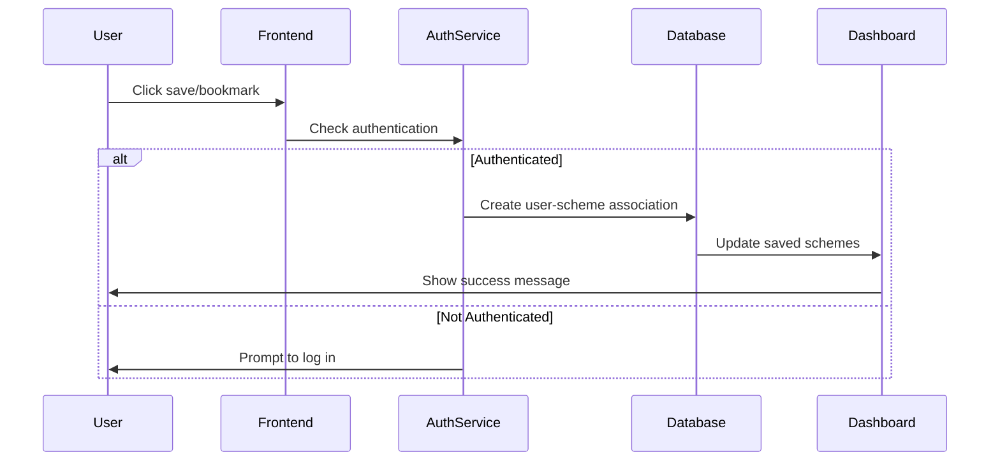

**Data Pipeline Flow:**
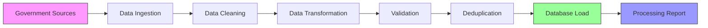

## Components and Interfaces

### Component Interaction Diagram

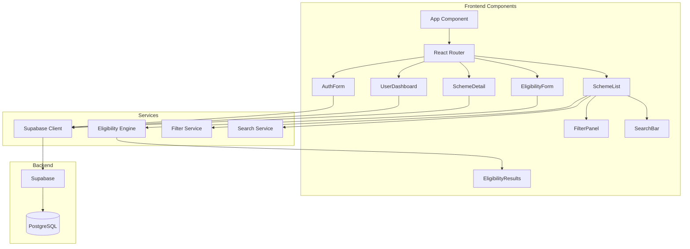

### Frontend Components

#### 1. App Component
- **Responsibility**: Root component, routing setup, global state provider
- **Dependencies**: React Router, AuthContext, ThemeContext
- **Routes**: 
  - `/` - Home/Browse page
  - `/scheme/:id` - Scheme detail page
  - `/eligibility` - Eligibility checker
  - `/dashboard` - User dashboard (protected)
  - `/login` - Login page
  - `/register` - Registration page

#### 2. SchemeList Component
- **Responsibility**: Display paginated list of schemes with search and filters
- **Props**: 
  - `schemes: Scheme[]` - Array of schemes to display
  - `onSchemeClick: (id: string) => void` - Handler for scheme selection
- **State**: 
  - `searchQuery: string` - Current search input
  - `filters: FilterState` - Active filters
  - `currentPage: number` - Current pagination page
- **Methods**:
  - `handleSearch(query: string)` - Debounced search handler
  - `applyFilters(filters: FilterState)` - Apply filter combination
  - `handlePageChange(page: number)` - Navigate to page

#### 3. SearchBar Component
- **Responsibility**: Search input with debounce
- **Props**:
  - `onSearch: (query: string) => void` - Search callback
  - `debounceMs: number` - Debounce interval (default 300ms)
- **Implementation**: Uses `useDebouncedValue` hook

#### 4. FilterPanel Component
- **Responsibility**: Multi-dimensional filter controls
- **Props**:
  - `onFilterChange: (filters: FilterState) => void` - Filter change callback
  - `activeFilters: FilterState` - Currently active filters
- **Filters**:
  - State dropdown (36 states/UTs)
  - Ministry dropdown
  - Gender radio buttons
  - Age range slider
  - Income range slider
  - Caste category dropdown
  - Employment status dropdown
  - Disability status checkbox

#### 5. EligibilityForm Component
- **Responsibility**: 6-step form for collecting user information
- **Steps**:
  1. Personal Details (name, age, gender)
  2. Location (state, district)
  3. Demographics (caste, religion)
  4. Income (annual income, BPL status)
  5. Employment (status, occupation)
  6. Special Categories (disability, minority, etc.)
- **Props**:
  - `onSubmit: (userData: UserConstraints) => void` - Form submission callback
- **Validation**: Client-side validation for each step

#### 6. EligibilityResults Component
- **Responsibility**: Display eligibility evaluation results
- **Props**:
  - `results: EligibilityResult[]` - Sorted schemes with scores
  - `userConstraints: UserConstraints` - User's provided information
- **Display**: 
  - Eligible schemes (score > threshold)
  - Partially eligible schemes
  - Ineligible schemes (collapsed by default)

#### 7. SchemeDetail Component
- **Responsibility**: Display comprehensive scheme information
- **Props**:
  - `schemeId: string` - Scheme identifier
- **Sections**:
  - Overview (name, ministry, category)
  - Description
  - Eligibility Criteria (formatted list)
  - Benefits (formatted list)
  - Required Documents (formatted list)
  - Official Link (external link button)
  - Save/Bookmark button (if authenticated)

#### 8. UserDashboard Component
- **Responsibility**: Display user's saved schemes
- **Protected**: Requires authentication
- **Features**:
  - List of saved schemes
  - Remove bookmark functionality
  - Quick access to scheme details

#### 9. AuthForm Component
- **Responsibility**: Login and registration forms
- **Modes**: `login` | `register`
- **Props**:
  - `mode: 'login' | 'register'` - Form mode
  - `onSuccess: () => void` - Success callback
- **Validation**:
  - Email format validation
  - Password strength validation (min 8 chars, uppercase, lowercase, number)

### Frontend Services

#### SupabaseClient
```typescript
interface SupabaseClient {
  // Authentication
  signUp(email: string, password: string): Promise<AuthResponse>
  signIn(email: string, password: string): Promise<AuthResponse>
  signOut(): Promise<void>
  getSession(): Promise<Session | null>
  
  // Schemes
  getSchemes(page: number, pageSize: number): Promise<Scheme[]>
  getSchemeById(id: string): Promise<Scheme | null>
  
  // Saved Schemes
  saveScheme(userId: string, schemeId: string): Promise<void>
  removeSavedScheme(userId: string, schemeId: string): Promise<void>
  getSavedSchemes(userId: string): Promise<Scheme[]>
}
```

#### SearchService
```typescript
interface SearchService {
  search(query: string, schemes: Scheme[]): Scheme[]
}

// Implementation uses keyword matching across:
// - scheme.name
// - scheme.description
// - scheme.category
// - scheme.ministry
```

#### FilterService
```typescript
interface FilterState {
  state?: string
  ministry?: string
  gender?: 'male' | 'female' | 'other'
  ageRange?: [number, number]
  incomeRange?: [number, number]
  casteCategory?: string
  employmentStatus?: string
  disabilityStatus?: boolean
}

interface FilterService {
  applyFilters(schemes: Scheme[], filters: FilterState): Scheme[]
}

// Implementation uses AND logic:
// All specified filters must match for a scheme to be included
```

#### EligibilityEngine
```typescript
interface UserConstraints {
  age: number
  gender: 'male' | 'female' | 'other'
  state: string
  district?: string
  casteCategory?: string
  religion?: string
  annualIncome: number
  bplStatus: boolean
  employmentStatus: string
  occupation?: string
  disabilityStatus: boolean
  minorityStatus: boolean
}

interface EligibilityResult {
  scheme: Scheme
  eligible: boolean
  score: number
  matchedConstraints: string[]
  unmatchedConstraints: string[]
}

interface EligibilityEngine {
  evaluate(schemes: Scheme[], userConstraints: UserConstraints): EligibilityResult[]
}
```

**Eligibility Algorithm:**

```mermaid
flowchart TD
    Start([Start: User Constraints + Schemes]) --> Loop{For each scheme}
    Loop --> Extract[Extract eligibility constraints]
    Extract --> CheckAge{Has age constraint?}
    CheckAge -->|Yes| ValidateAge[Check: minAge ≤ user.age ≤ maxAge]
    CheckAge -->|No| CheckIncome
    ValidateAge --> CheckIncome{Has income constraint?}
    CheckIncome -->|Yes| ValidateIncome[Check: user.income ≤ maxIncome]
    CheckIncome -->|No| CheckState
    ValidateIncome --> CheckState{Has state constraint?}
    CheckState -->|Yes| ValidateState[Check: user.state in applicableStates]
    CheckState -->|No| CheckGender
    ValidateState --> CheckGender{Has gender constraint?}
    CheckGender -->|Yes| ValidateGender[Check: user.gender matches]
    CheckGender -->|No| CheckCaste
    ValidateGender --> CheckCaste{Has caste constraint?}
    CheckCaste -->|Yes| ValidateCaste[Check: user.caste in categories]
    CheckCaste -->|No| CheckEmployment
    ValidateCaste --> CheckEmployment{Has employment constraint?}
    CheckEmployment -->|Yes| ValidateEmployment[Check: user.employment matches]
    CheckEmployment -->|No| CheckDisability
    ValidateEmployment --> CheckDisability{Has disability constraint?}
    CheckDisability -->|Yes| ValidateDisability[Check: user.disability matches]
    CheckDisability -->|No| CalcScore
    ValidateDisability --> CalcScore[Calculate Score: matched/total]
    CalcScore --> CheckEligible{All mandatory constraints satisfied?}
    CheckEligible -->|Yes| MarkEligible[Mark as eligible]
    CheckEligible -->|No| MarkIneligible[Mark as ineligible]
    MarkEligible --> StoreResult[Store result with score]
    MarkIneligible --> StoreResult
    StoreResult --> Loop
    Loop -->|All schemes processed| Sort[Sort by score descending]
    Sort --> End([Return sorted results])
```

**Algorithm Steps:**
1. For each scheme, extract eligibility constraints
2. For each constraint, check if user satisfies it:
   - Age: `user.age >= constraint.minAge && user.age <= constraint.maxAge`
   - Income: `user.annualIncome <= constraint.maxIncome`
   - State: `constraint.applicableStates.includes(user.state)`
   - Gender: `constraint.gender === user.gender || constraint.gender === 'all'`
   - Caste: `constraint.casteCategories.includes(user.casteCategory)`
   - Employment: `constraint.employmentStatuses.includes(user.employmentStatus)`
   - Disability: `constraint.requiresDisability === user.disabilityStatus`
3. Calculate score: `score = matchedConstraints.length / totalConstraints.length`
4. Mark as eligible if all mandatory constraints are satisfied
5. Sort results by score (descending)

### Backend Components

#### Database Schema Diagram

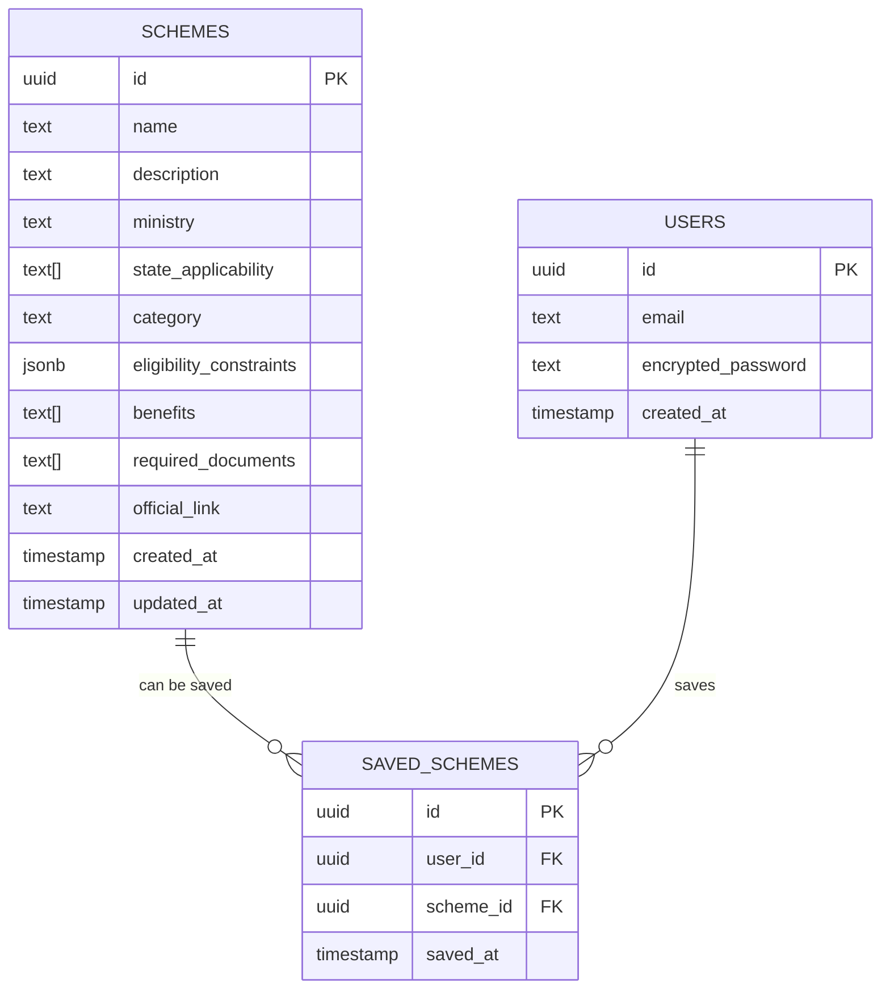

#### Database Schema

**schemes table:**
```sql
CREATE TABLE schemes (
  id UUID PRIMARY KEY DEFAULT uuid_generate_v4(),
  name TEXT NOT NULL,
  description TEXT NOT NULL,
  ministry TEXT NOT NULL,
  state_applicability TEXT[], -- Array of applicable states
  category TEXT NOT NULL,
  eligibility_constraints JSONB NOT NULL,
  benefits TEXT[] NOT NULL,
  required_documents TEXT[] NOT NULL,
  official_link TEXT,
  created_at TIMESTAMP DEFAULT NOW(),
  updated_at TIMESTAMP DEFAULT NOW()
);

CREATE INDEX idx_schemes_ministry ON schemes(ministry);
CREATE INDEX idx_schemes_category ON schemes(category);
CREATE INDEX idx_schemes_state ON schemes USING GIN(state_applicability);
CREATE INDEX idx_schemes_search ON schemes USING GIN(to_tsvector('english', name || ' ' || description));
```

**eligibility_constraints JSONB structure:**
```json
{
  "age": {"min": 18, "max": 60},
  "gender": "all" | "male" | "female",
  "states": ["state1", "state2"],
  "income": {"max": 500000},
  "casteCategories": ["SC", "ST", "OBC"],
  "employmentStatuses": ["unemployed", "self-employed"],
  "requiresDisability": false,
  "requiresMinority": false,
  "requiresBPL": false
}
```

**users table:**
```sql
-- Managed by Supabase Auth
-- Contains: id, email, encrypted_password, created_at, etc.
```

**saved_schemes table:**
```sql
CREATE TABLE saved_schemes (
  id UUID PRIMARY KEY DEFAULT uuid_generate_v4(),
  user_id UUID NOT NULL REFERENCES auth.users(id) ON DELETE CASCADE,
  scheme_id UUID NOT NULL REFERENCES schemes(id) ON DELETE CASCADE,
  saved_at TIMESTAMP DEFAULT NOW(),
  UNIQUE(user_id, scheme_id)
);

CREATE INDEX idx_saved_schemes_user ON saved_schemes(user_id);
CREATE INDEX idx_saved_schemes_scheme ON saved_schemes(scheme_id);
```

**Row-Level Security Policies:**
```sql
-- Users can only read their own saved schemes
ALTER TABLE saved_schemes ENABLE ROW LEVEL SECURITY;

CREATE POLICY "Users can view own saved schemes"
  ON saved_schemes FOR SELECT
  USING (auth.uid() = user_id);

CREATE POLICY "Users can insert own saved schemes"
  ON saved_schemes FOR INSERT
  WITH CHECK (auth.uid() = user_id);

CREATE POLICY "Users can delete own saved schemes"
  ON saved_schemes FOR DELETE
  USING (auth.uid() = user_id);

-- All users can read schemes
CREATE POLICY "Schemes are publicly readable"
  ON schemes FOR SELECT
  USING (true);
```

### Data Processing Pipeline

#### Python ETL Pipeline Components

**1. DataIngestion Module**
```python
class DataIngestion:
    def fetch_from_sources(self) -> List[Dict]:
        """Fetch raw scheme data from government sources"""
        pass
    
    def parse_html(self, html: str) -> Dict:
        """Parse HTML content to extract scheme information"""
        pass
    
    def parse_pdf(self, pdf_path: str) -> Dict:
        """Extract scheme information from PDF documents"""
        pass
```

**2. DataCleaning Module**
```python
class DataCleaning:
    def remove_duplicates(self, schemes: List[Dict]) -> List[Dict]:
        """Remove duplicate schemes based on name and ministry"""
        pass
    
    def clean_text(self, text: str) -> str:
        """Remove extra whitespace, special characters, formatting"""
        pass
    
    def standardize_fields(self, scheme: Dict) -> Dict:
        """Standardize field names and values"""
        pass
    
    def validate_required_fields(self, scheme: Dict) -> bool:
        """Check if all required fields are present"""
        pass
```

**3. DataTransformation Module**
```python
class DataTransformation:
    def extract_eligibility_constraints(self, raw_text: str) -> Dict:
        """Parse eligibility text into structured constraints"""
        pass
    
    def normalize_state_names(self, state: str) -> str:
        """Standardize state names to consistent format"""
        pass
    
    def parse_income_range(self, text: str) -> Dict:
        """Extract income constraints from text"""
        pass
    
    def parse_age_range(self, text: str) -> Dict:
        """Extract age constraints from text"""
        pass
```

**4. DataLoader Module**
```python
class DataLoader:
    def load_to_database(self, schemes: List[Dict]) -> None:
        """Insert schemes into PostgreSQL database"""
        pass
    
    def generate_report(self, stats: Dict) -> str:
        """Generate processing report"""
        pass
```

**Pipeline Execution Flow:**
1. Fetch raw data from government sources
2. Parse HTML/PDF documents
3. Clean and validate data
4. Transform into standardized schema
5. Extract and structure eligibility constraints
6. Remove duplicates
7. Load into PostgreSQL database
8. Generate processing report

## Data Models

### Frontend TypeScript Interfaces

```typescript
interface Scheme {
  id: string
  name: string
  description: string
  ministry: string
  stateApplicability: string[]
  category: string
  eligibilityConstraints: EligibilityConstraints
  benefits: string[]
  requiredDocuments: string[]
  officialLink?: string
  createdAt: Date
  updatedAt: Date
}

interface EligibilityConstraints {
  age?: {
    min?: number
    max?: number
  }
  gender?: 'all' | 'male' | 'female'
  states?: string[]
  income?: {
    max?: number
  }
  casteCategories?: string[]
  employmentStatuses?: string[]
  requiresDisability?: boolean
  requiresMinority?: boolean
  requiresBPL?: boolean
}

interface UserConstraints {
  age: number
  gender: 'male' | 'female' | 'other'
  state: string
  district?: string
  casteCategory?: string
  religion?: string
  annualIncome: number
  bplStatus: boolean
  employmentStatus: string
  occupation?: string
  disabilityStatus: boolean
  minorityStatus: boolean
}

interface EligibilityResult {
  scheme: Scheme
  eligible: boolean
  score: number
  matchedConstraints: string[]
  unmatchedConstraints: string[]
}

interface FilterState {
  state?: string
  ministry?: string
  gender?: 'male' | 'female' | 'other'
  ageRange?: [number, number]
  incomeRange?: [number, number]
  casteCategory?: string
  employmentStatus?: string
  disabilityStatus?: boolean
}

interface SavedScheme {
  id: string
  userId: string
  schemeId: string
  savedAt: Date
}

interface AuthUser {
  id: string
  email: string
  createdAt: Date
}

interface AuthResponse {
  user: AuthUser | null
  session: Session | null
  error: Error | null
}

interface Session {
  accessToken: string
  refreshToken: string
  expiresAt: number
}
```

### Database Models

The database models are defined in the Components and Interfaces section under "Database Schema".

## Correctness Properties

*A property is a characteristic or behavior that should hold true across all valid executions of a system—essentially, a formal statement about what the system should do. Properties serve as the bridge between human-readable specifications and machine-verifiable correctness guarantees.*


### Property 1: Scheme Field Validation
*For any* scheme data submitted to the Data_Pipeline, validation should correctly identify whether all required fields (id, name, description, ministry, state_applicability, category, eligibility_constraints, benefits, required_documents, official_link) are present.

**Validates: Requirements 1.2, 9.4**

### Property 2: Duplicate Prevention
*For any* scheme, if it is added to the Scheme_Repository multiple times (based on name and ministry), only one entry should exist in the repository.

**Validates: Requirements 1.3**

### Property 3: Data Standardization
*For any* unstructured government data from different sources, after processing through the Data_Pipeline, all schemes should conform to the same standardized schema with consistent field names and value formats.

**Validates: Requirements 1.4, 9.2**

### Property 4: Storage Round-Trip Preservation
*For any* valid scheme, storing it in the Scheme_Repository and then retrieving it should produce an equivalent scheme with all original information preserved.

**Validates: Requirements 1.6**

### Property 5: Search Field Coverage
*For any* search query and scheme dataset, if a scheme contains the query text in its name, description, category, or ministry fields, it should appear in the search results.

**Validates: Requirements 2.2**

### Property 6: Search Result Highlighting
*For any* search query that returns results, the rendered output should include the search query terms in the displayed scheme information.

**Validates: Requirements 2.3**

### Property 7: Filter Type Support
*For any* filter type (state, ministry, gender, age_range, income_range, caste_category, employment_status, disability_status), applying that filter should correctly filter schemes based on the specified criteria.

**Validates: Requirements 3.1**

### Property 8: Filter AND Logic
*For any* combination of multiple filters, the Filter_Service should return only schemes that satisfy all applied filters (AND logic).

**Validates: Requirements 3.2**

### Property 9: Filter Removal Equivalence
*For any* set of filters, removing a filter should produce the same result as if that filter was never applied in the first place.

**Validates: Requirements 3.4**

### Property 10: Filter Count Accuracy
*For any* active filter combination, the displayed count should equal the actual number of schemes that match all filters.

**Validates: Requirements 3.5**

### Property 11: Eligibility Constraint Evaluation
*For any* user constraints and scheme with eligibility requirements, the Eligibility_Engine should evaluate each constraint independently and correctly determine if the user satisfies each one.

**Validates: Requirements 4.2**

### Property 12: Eligibility AND Logic with Determinism
*For any* user constraints and scheme, the Eligibility_Engine should mark a scheme as eligible only when all mandatory constraints are satisfied, and repeated evaluations with the same inputs should always produce identical results.

**Validates: Requirements 4.3, 11.2, 11.6**

### Property 13: Eligibility Score Calculation
*For any* user constraints and scheme, the eligibility score should equal the ratio of matched constraints to total constraints (matchedCount / totalCount).

**Validates: Requirements 4.4**

### Property 14: Eligibility Result Sorting
*For any* set of eligibility results, schemes should be sorted in descending order by eligibility score, with eligible schemes appearing before ineligible ones.

**Validates: Requirements 4.5**

### Property 15: Scheme Detail Rendering Completeness
*For any* scheme, the detail page rendering should include all required fields: name, description, ministry, state_applicability, category, eligibility_criteria, benefits, required_documents, and official_link (if present).

**Validates: Requirements 5.1**

### Property 16: Document List Rendering
*For any* scheme with required documents, the rendered output should display documents as a structured list format.

**Validates: Requirements 5.3**

### Property 17: Conditional Link Rendering
*For any* scheme, if an official_link is present, the rendered output should include a clickable link; if absent, no link should be rendered.

**Validates: Requirements 5.4**

### Property 18: Email and Password Validation
*For any* registration attempt, the Auth_Service should validate that the email follows standard email format and the password meets strength requirements (minimum 8 characters, contains uppercase, lowercase, and number).

**Validates: Requirements 6.2**

### Property 19: Authentication Error Message Security
*For any* invalid login credentials, the error message should not reveal whether the email or password was incorrect.

**Validates: Requirements 6.4**

### Property 20: Session Token Issuance
*For any* successful authentication, the Auth_Service should issue a valid session token with access_token, refresh_token, and expiration time.

**Validates: Requirements 6.5**

### Property 21: Row-Level Security Enforcement
*For any* user attempting to access saved schemes, the system should only return schemes saved by that specific user, preventing access to other users' saved schemes.

**Validates: Requirements 6.6, 10.3**

### Property 22: Bookmark Round-Trip
*For any* authenticated user and scheme, saving the scheme and then retrieving saved schemes should include that scheme in the results.

**Validates: Requirements 7.1**

### Property 23: Saved Scheme Retrieval Completeness
*For any* authenticated user, retrieving saved schemes should return all schemes that user has bookmarked, with no schemes missing.

**Validates: Requirements 7.2**

### Property 24: Bookmark Deletion
*For any* authenticated user and saved scheme, removing the bookmark should result in that scheme no longer appearing in the user's saved schemes list.

**Validates: Requirements 7.3**

### Property 25: Unauthenticated Save Prevention
*For any* unauthenticated request to save a scheme, the system should reject the request with an authorization error.

**Validates: Requirements 7.4**

### Property 26: Saved Scheme Rendering Consistency
*For any* scheme, the rendering in the saved schemes dashboard should be identical to the rendering in the browse view.

**Validates: Requirements 7.6**

### Property 27: Pagination Page Size
*For any* paginated scheme list, each page should contain exactly 20 schemes (or fewer for the last page).

**Validates: Requirements 8.1**

### Property 28: Pagination State Preservation
*For any* active filters and search query, navigating between pages should preserve the filter and search state, showing consistent results.

**Validates: Requirements 8.5**

### Property 29: Data Cleaning Consistency
*For any* malformed government data with inconsistencies or formatting errors, the Data_Pipeline cleaning process should produce consistent, well-formed output.

**Validates: Requirements 9.1**

### Property 30: Pipeline Error Resilience
*For any* batch of scheme data containing some invalid records, the Data_Pipeline should log errors for invalid records and successfully process all valid records.

**Validates: Requirements 9.3**

### Property 31: Processing Report Accuracy
*For any* pipeline execution, the generated report should accurately reflect the number of schemes processed, errors encountered, and duplicates prevented.

**Validates: Requirements 9.5**

### Property 32: Password Hashing
*For any* user registration, the stored password in the database should be hashed (not plaintext) and should not be reversible to the original password.

**Validates: Requirements 10.2**

### Property 33: Eligibility Data Non-Persistence
*For any* unauthenticated eligibility check, the user's eligibility information should not be stored in the database after the session ends.

**Validates: Requirements 10.5**

### Property 34: Independent Constraint Evaluation
*For any* scheme with multiple constraints, evaluating each constraint should be independent such that the result of one constraint evaluation does not affect another.

**Validates: Requirements 11.1**

### Property 35: Missing Data Handling
*For any* user constraints with missing optional fields, the Eligibility_Engine should treat missing fields as not satisfying optional constraints without causing errors.

**Validates: Requirements 11.3**

### Property 36: Range Constraint Checking
*For any* constraint involving a range (age or income), the Eligibility_Engine should correctly determine if the user's value falls within the specified minimum and maximum bounds (inclusive).

**Validates: Requirements 11.4**

### Property 37: Categorical Constraint Matching
*For any* constraint involving categorical values (state, gender, caste), the Eligibility_Engine should require exact matches between the user's value and the constraint's allowed values.

**Validates: Requirements 11.5**

## Error Handling

### Frontend Error Handling

**Network Errors:**
- Display user-friendly error messages for failed API calls
- Implement retry logic with exponential backoff for transient failures
- Show offline indicator when network is unavailable

**Authentication Errors:**
- Redirect to login page when session expires
- Display clear error messages for invalid credentials
- Handle token refresh failures gracefully

**Validation Errors:**
- Display inline validation errors in forms
- Prevent form submission until all validation passes
- Highlight invalid fields with clear error messages

**Search/Filter Errors:**
- Handle empty results gracefully with helpful messages
- Recover from invalid filter combinations
- Clear invalid state when filters are reset

### Backend Error Handling

**Database Errors:**
- Log database connection failures
- Return appropriate HTTP status codes (500 for server errors)
- Implement connection pooling and retry logic

**Authentication Errors:**
- Return 401 for unauthenticated requests
- Return 403 for unauthorized access attempts
- Log suspicious authentication attempts

**Data Validation Errors:**
- Return 400 for invalid request data
- Provide detailed validation error messages
- Sanitize error messages to prevent information leakage

### Data Pipeline Error Handling

**Ingestion Errors:**
- Log failed data fetches with source information
- Continue processing other sources on individual failures
- Generate error reports for manual review

**Parsing Errors:**
- Log unparseable documents with identifiers
- Skip malformed records and continue processing
- Track parsing success rate in reports

**Validation Errors:**
- Log schemes that fail validation with reasons
- Prevent invalid schemes from entering database
- Include validation failures in processing reports

**Database Errors:**
- Implement transaction rollback on failures
- Log database errors with context
- Retry failed insertions with exponential backoff

## Testing Strategy

### Dual Testing Approach

The testing strategy employs both unit tests and property-based tests to ensure comprehensive coverage:

**Unit Tests** focus on:
- Specific examples demonstrating correct behavior
- Edge cases (empty results, missing data, boundary values)
- Error conditions and exception handling
- Integration points between components
- UI component rendering with specific props

**Property-Based Tests** focus on:
- Universal properties that hold for all inputs
- Comprehensive input coverage through randomization
- Correctness guarantees across the input space
- Invariants that must always be maintained

Both approaches are complementary and necessary. Unit tests catch concrete bugs and validate specific scenarios, while property tests verify general correctness across many generated inputs.

### Property-Based Testing Configuration

**Library Selection:**
- **Frontend (TypeScript)**: Use `fast-check` library for property-based testing
- **Backend/Pipeline (Python)**: Use `hypothesis` library for property-based testing

**Test Configuration:**
- Each property test must run minimum 100 iterations
- Each test must reference its design document property
- Tag format: `Feature: scheme-finder, Property {number}: {property_text}`

**Example Property Test Structure (TypeScript):**
```typescript
import fc from 'fast-check';

// Feature: scheme-finder, Property 8: Filter AND Logic
test('Filter AND Logic', () => {
  fc.assert(
    fc.property(
      fc.array(schemeArbitrary),
      fc.record({
        state: fc.option(fc.string()),
        ministry: fc.option(fc.string()),
        gender: fc.option(fc.constantFrom('male', 'female', 'other'))
      }),
      (schemes, filters) => {
        const result = filterService.applyFilters(schemes, filters);
        // All returned schemes must satisfy all applied filters
        result.forEach(scheme => {
          if (filters.state) expect(scheme.stateApplicability).toContain(filters.state);
          if (filters.ministry) expect(scheme.ministry).toBe(filters.ministry);
          if (filters.gender) expect(scheme.eligibilityConstraints.gender).toBe(filters.gender);
        });
      }
    ),
    { numRuns: 100 }
  );
});
```

**Example Property Test Structure (Python):**
```python
from hypothesis import given, strategies as st

# Feature: scheme-finder, Property 2: Duplicate Prevention
@given(st.lists(scheme_strategy(), min_size=1))
def test_duplicate_prevention(schemes):
    # Add same scheme twice
    pipeline.add_scheme(schemes[0])
    pipeline.add_scheme(schemes[0])
    
    # Should only have one entry
    result = repository.get_schemes_by_name_and_ministry(
        schemes[0].name, 
        schemes[0].ministry
    )
    assert len(result) == 1
```

### Unit Testing Strategy

**Frontend Unit Tests (Jest + React Testing Library):**
- Component rendering tests
- User interaction tests (clicks, form submissions)
- State management tests
- Routing tests
- API client tests (mocked)

**Backend Unit Tests (Python pytest):**
- Data pipeline module tests
- Data cleaning and transformation tests
- Validation logic tests
- Database query tests (with test database)

**Integration Tests:**
- End-to-end user flows (browse → filter → save)
- Authentication flows (register → login → access protected routes)
- Eligibility check flow (form → evaluation → results)
- Data pipeline integration (fetch → clean → transform → load)

### Test Coverage Goals

- Minimum 80% code coverage for all modules
- 100% coverage for critical paths (authentication, eligibility engine, data validation)
- All 37 correctness properties implemented as property-based tests
- Edge cases covered by unit tests (empty results, missing data, invalid inputs)

### Continuous Integration

- Run all tests on every commit
- Run property tests with 100 iterations in CI
- Run extended property tests (1000+ iterations) nightly
- Block merges if tests fail or coverage drops below threshold
